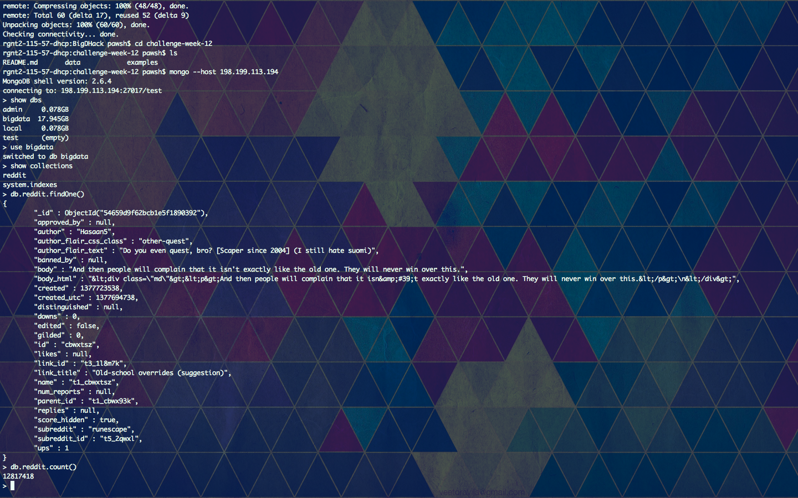

# Challenge Week 12 Submission Template

# Reddit Data Challenges

## Challenge 1

## Challenge 2

It's interesting that we have the id of the parent comment, as lots of interesting things could be learned from looking at the parents of comments.

## Challenge 3

We could learn for example if the total number of comments on reddit is largely replies to other comments, or replies to the main thread in which the comment was posted. 
## Challenge 4

Which causes more comments, comments themselves or replies to other comments.

## Challenge 5

[Link to Code or pasted code]
[Answer]

## Challenge 6

[It would show that unpopular users (don't recieve more than 10 upvotes on their posts) are unaccounted for.]

## Challenge 7

[My conclusion would probably change in that 2 different subreddits would have more users in common.]

## Challenge 8

The time in which these comments were collected is a bias, and we would have to have live-updating data for this to be a non-biased general statement.

## Challenge 9

[another bias is that comments from private subreddits are not displayed in this dataset.]

## Challenge 10

[show that comments increment sequentially thne show there are missing comments in the sequence.]

# Yelp and Weather 

## Challenge 1

[db.prec.aggregate([{$match: {"STATION_NAME":"MADISON DANE CO REGIONAL AIRPORT WI US", "DATE":/^20100425/}}, {$group: {_id: "$STATION_NAME", total:{$sum:"$HPCP"}}}])]
[{ "_id" : "MADISON DANE CO REGIONAL AIRPORT WI US", "total" : 62 }]

## Challenge 2

db.norm.aggregate([{$match: {"STATION_NAME":"LAS VEGAS MCCARRAN INTERNATIONAL AIRPORT NV US", "DATE":/^20100425/}}, {$group: {_id: "$STATION_NAME",avg:{$avg:"$HLY-WIND-AVGSPD"}}}])
{ "_id" : "LAS VEGAS MCCARRAN INTERNATIONAL AIRPORT NV US", "avg" : 110.08333333333333 }

## Challenge 3

[db.businesses.aggregate([{$match: {"city":"Madison"}}, {$group: {_id: "$city",total:{$sum:"$review_count"}}}])]
[{ "_id" : "Madison", "total" : 34410 }]

## Challenge 4

[db.businesses.aggregate([{$match: {"city":"Las Vegas"}}, {$group: {_id: "$city",total:{$sum:"$review_count"}}}])]
[{ "_id" : "Las Vegas", "total" : 577550 }]

## Challenge 5

[db.businesses.aggregate([{$match: {"city":"Phoenix"}}, {$group: {_id: "$city",total:{$sum:"$review_count"}}}])]
[{ "_id" : "Phoenix", "total" : 200089 }]

## Challenge 6 [BONUS]

[Code]
[Answer]

